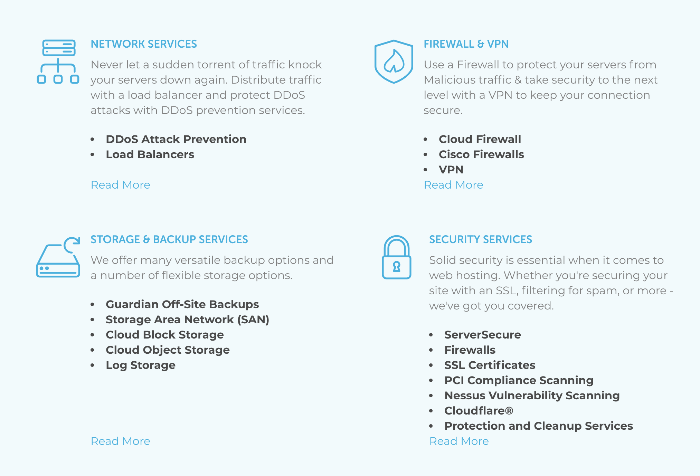

autoscale: true
build-lists: true

# [fit] WordPress Security Basics

### _**Ryan Plas - @wordplas**_

^ Hello and welcome. My name is Ryan Plas and today I will be talking to you about the basics of WordPress security.  Before I get into that, there’s one concept I want you to have in mind while we go through this talk.

---

# [fit] Defense In Depth

^ That concept is called “Defense in depth”.

---
[.footer: 1: https://en.wikipedia.org/wiki/Defense_in_depth_(computing)]

# Defense In Depth

> The idea behind the defense in depth approach is to defend a system against any particular attack using several independent methods.<sup>1</sup>

There is no single approach to security - have many layers.

^ Defense is depth is basically the idea that you need to have multiple layers of defense, rather than trusting just one.  In this talk, I will be enforcing defense in depth by teaching you some tips for securing multiple layers of your WordPress site.

---

# Defense In Depth

__Layers:__

1. Code
2. Authentication
3. Hosting

^ Those layers are namely Code, Authentication, and Hosting.

---

# [fit] Code

^ I want to begin with the code layer.

---

# Code

__What this section isn't:__ How to write secure code

__What this section is:__ How to make sure the code of your site is secure


^ Now, this won’t be how to actually write secure code, but rather how to make sure the code that makes up your site and the code that you add to your site through plugins and themes keep your site secure.

---

# Code

__Keep your site updated__

* Auto updates for minor versions since 3.7
* Update to major versions as soon as possible

^ The best thing you can do to keep your site secure is to keep it updated to the latest version of WordPress.  Since version 3.7, WordPress has included automatic updates for minor releases (anytime the number after the point is increase), but you should also update to the newest major version as soon as possible.

---

# Code

__Keep your plugins and themes updated__

* The longer you wait, the more likely there's a vulnerability.
* [WPScan Vulnerability Database](https://wpvulndb.com/)

^ Along with that, it’s important to keep you plugins and themes up to date as well.  Plugins and themes can have vulnerabilities and bugs just like WordPress core, so the longer you wait to update them, the more possibility there is that your site is vulnerable.

---

# Code

__Only use plugins and themes from reputable sources__

* Trusted brands/companies
* Don't avoid paying money
* Don't look for free versions of premium plugins/themes
* The Plugin/Theme repo is your friend

^ Also, with plugins and themes, it’s important to only use ones from reputable sources.  Here are some general tips for picking out good plugins and themes.  These aren’t fool-proof, but if the one you’re looking at checks a lot of these boxes, it’s a good sign.  Look for brands/companies that people trust. If lots of people are talking about a plugin, that’s a good sign. Don’t be afraid to pay some money.  While not always a sign of a secure plugin, it can point to a team that would have the resources to make sure their code is safe.

---


---


# [fit] If the site looks like this...run!

---

# [fit] Authentication

^ Next, I want to talk about how to secure your authentication layer.  Authentication just means anything that has to do with user accounts and logins.

---

# Authentication

__Use a strong password__

* Question...what is a strong password?

^ The first and probably most obvious tip for authentication security is to use a strong password.  The next question you have is probably “What’s is a strong password”? The answer to that leads into my next tip

---

# Authentication

__Use one of preferably both of the following:__

* Password manager
* Two-factor authentication

^ use one of preferably both of the following: a password manager and/or two-factor authentication.

---

# Authentication

__Password Manager:__

* Program that can create and securely store passwords
* Allows you to use longer/more complex passwords without having to memorize or write them down

^ A password manager is an application that can generate and securely save password for applications and websites.  This is useful because it allows you to use longer or more complex passwords without having to memorize them or write them down somewhere insecure.

---

# Authentication

__Two-factor Authentication:__

* Something you know - password, pin
* Something you have - phone, YubiKey

^ Two-factor authentication is just what it sounds like - using two “factors” when you log in.  You might ask - what’s a factor.  In this case, the two factors being considered are usually “something you know” and “something you have”. Something you know can be a password or a pin, and something you have can be a phone with an authentication app or something like a yubikey.  This is used to generate one time use passwords or other machine generated authentication methods.  The benefit here is that there is now two things required to log in to your site.  This may seem like you’re just adding extra work, and you are a bit, but this makes it so even if an attacker gets your password, your site is still safe because of your second factor.

---

# Authentication

__Passwords:__
Use a password manager and/or two-factor authentication

* LastPass, 1Password, Dashlane - __Personal__
* Duo, Google Authenticator, etc. - __Plugin__

If you can't do that, use a long but easy to remember password.

  * correct horse battery staple
  * [date]-[place]-[thing]: 1976-Switzerland-dragon

^ So the best thing you can do to have a strong password is to use both a password manager and two-factor authentication. If for some reason you can't (company/cost restrictions) then the next best thing is to use a long, but easily memorizable (for you) password.  correct horse battery staple is usually the example given, but you could also do something like a date a place and a thing your mind associates with that date and place. Like 1976-Switzerland-dragon

---

# [fit] Principle of Least Privilege

^ The second tip for authentication security is to follow the Principle of least privilege.

---

# Authentication

__Principle of least privilege:__

* Any user should only be able to access exactly what they need to and nothing else.
* Don't make everyone an admin
* Restrict user roles to only what is required
* Use a plugin if necessary

^ The principle fo least privilege says that any user should only be able to access exactly what they need to and nothings else.  This means that not every user on your site needs to be an admin, perhaps even your main account.  For example, someone that writes posts on your blog probably doesn’t also need to be able to install plugins.  WordPress has a fairly robust user role system that can be extended with plugins.  By limiting user roles, your are also limiting the attack surface for your site.

---

# Authentication

__Bonus:__ Don't use `admin` as a username

^ While we’re talking about user and roles, a bonus suggestion would be to not use admin as your admin account username.  Attackers are expecting this, and it allows them to automate their attacks more easily.  While WordPress usernames can be enumerated, this makes an attacker jump through more hoops and anything we can do to slow them down is good.  (Defense in depth)

---

# [fit] Hosting

---

# Hosting

__What to look for in a good hosting provider:__

* SSL
* Firewall
* Datacenter
* Customer Support

---



---


---

# [fit]Rapid-fire Tips

---

# Disable File Editing

In __wp-config.php__:

```
## Disable Editing in Dashboard
define('DISALLOW_FILE_EDIT', true);
```

---

# Limit Login Attempts

* Make brute forcing passwords take __much longer__
* Potentially __block malicious attempts__
* Lots of plugins that do this
  * JetPack, Limit Login Attempts

---

# Backup Your Site

* Helps in the event of a security incident
* Able to __roll back__ to an unaffected backup
* Lots of plugins/services that do this
  * Backup Buddy, BackWPUp

---

# "Complete" Solutions

* No solution is __"complete"__ (Defense in Depth)
* But...these have a lot of the features we talked about
  * __iThemes Security__ - plugin
  * __JetPack__ - plugin
  * __Wordfence__ - plugin
  * __Securi__ - hosting/security platform

---

# wpscan

* Command-line utility to __scan a WP install__ for vulnerabilities
* [https://github.com/wpscanteam/wpscan](https://github.com/wpscanteam/wpscan)
* __\*ONLY USE ON SITES YOU OWN\*__

---

# Overview

* __Defense in Depth__
  * Many __layers__ of security
* Code
  * __Update__ your site/plugins/themes
  * Use __reputable__ plugins/themes
* Authentication
  * __Password Manager/Two-factor Authentication__
  * __Principle of Least Privilege__
* Hosting
  * Look for __emphasis on security__ (SSL, Firewall, Datacenter etc.)

---

# [fit] Questions?

---

# Ryan Plas
## @wordplas
## github.com/ryanplasma

